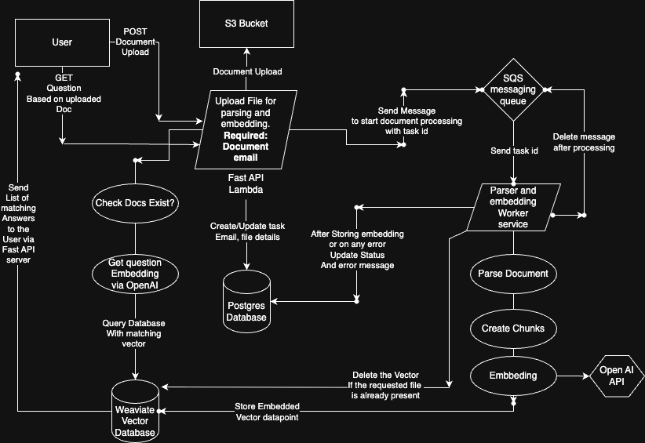

# RAG-BACK
Backend implementation for a Retrieval-Augmented Generation (RAG) system. It integrates document processing, embedding, storage, and querying functionalities.

## 🔧 Key Features
- FastAPI: Serves as the web framework for building RESTful APIs.
- OpenAI Embeddings: Utilizes OpenAI's models to generate vector representations of documents.
- Weaviate Vector Search: Employs Weaviate as the vector database for storing and retrieving document embeddings.


## 📁 Project Structure
- app/: Contains the main application code, including API endpoints and background workers.
- Dockerfile.api: Defines the Docker image for the API service. (Prod)
- Dockerfile.worker: Defines the Docker image for the background worker service. (Prod)
- Dockerfile.dev: Defines the Docker image for the API service and document processing in development. (Dev)
- requirements.txt: Lists the Python dependencies required for the project.
- .pre-commit-config.yaml: Configuration for pre-commit hooks to maintain code quality.

## ⚙️ Setup and Deployment
**Prerequisites:**
- Python3.12
- Docker if using Docker for development
- Direnv if not using docker for development
- postgresql
- Tesseract for ocr
- waeviate account with database configured
- hosted postgres url
- Open AI developer account

### 🔨 Devlopment:
**Docker**
- Build the docker image
The project includes Dockerfiles for containerizing both the API and worker services, facilitating deployment. Dependencies are managed using requirements.txt.
    ```
    docker build -t rag-server-dev -f Dockerfile.dev .
    ```
- Run the docker image to bring up the server
    ```
    docker run -p 8000:8000 --env-file .env rag-server-dev
    ```
Note: Refer environment setup to fill .env file other it will throw error

**Direnv**
- Create .envrc.local and place all the env variables
- Run `direnv allow` to create env
- Install poetry and the packages required for this repo
```
    pip install poetry
    poetry install
```
- Run migrations
```
alembic upgrade head
```
- Use uvicorn to run the server
```
uvicorn app.main:app --port 8090 --reload
```

### 🎬 Prod
Prod Deployment is configured based on AWS, and git actions for cicd
**AWS Setup**
- Create ecr repository for storing docker images used for deplyment as lambda function
    - `rag-api-server` for fastapi server
    - `rag-worker` for document parser and embedding
    - (Optional) `tesseract-ocr` for packaging in rag-worker at build time
- Create SQS Standard one. add its url to env variable.
- Create lambda functions one for worker which will be responsible for parsing and embedding the docs and one for API.
    - Create IAM Role for API server with following permissions
        - LambdaInvoke
        - S3 GET,PUT,LIST for bucket in use
        - SQS All access
    - Create IAM Role for Worker server with following permissions
        - S3 GET, LIST for bucket in use
        - SQS All access
    - Add env varible to both the lambdas as provided in env setup section
- Create API Gateway with HTTPv2 protocol and link it with API server lambda
- Create a AWS user for Github actions, and get the AWS_ACCESS_KEY_ID, AWS_SECRET_ACCESS_KEY, AWS_REGION, AWS_ACCOUNT_ID and store it in Secret of the repo of this fork

**Database Setup (Relational SQL)**
- Setup database on neondb or aws and copy the url and add it to env variable `PROD_DATABASE_URL`
- Run migration from local terminal whenever there is any new changes in the database
```
    alembic upgrade head
```

**Weaviate Vector Database setup**
- Create a cluster with dimensions set as 1538
- Collect API key and URL and store it in `WEAVIATE_OPENAI_ADMIN_KEY` and `WEAVIATE_URL` locally
- Then create a schema by running below command from backend directory
```
    python -m app.services.utils.create_schema_wrapper
```
**One time setup:**
- Build and push tesseract-ocr image to aws ecr repo which we created earlier and make sure its name matches in dockerfile.tesseract, use Dockerfile.tesseract for building image
    ```
        # Link aws account is connected with docker
        aws ecr get-login-password --region us-east-1 | docker login --username AWS --password-stdin <accountid>.dkr.ecr.us-east-1.amazonaws.com
        # Build tesseract image
        docker build --platform linux/amd64 TESSERACT_image <accountid>.dkr.ecr.us-east-1.amazonaws.com/tesseract-ocr-aws:latest  -t tesseract-ocr-aws -f Dockerfile.tesseract .
        # Tag it
        docker tag tesseract-ocr-aws:latest <accountid>.dkr.ecr.us-east-1.amazonaws.com/tesseract-ocr-aws:latest

        # Push to ecr
        docker push <accountid>.dkr.ecr.us-east-1.amazonaws.com/tesseract-ocr-aws:latest
    ```
- Make sure to update github workflow `deploy_api.yml` to use Dockerfile.worker.tesseract if ocr is needed else use Dockerfile.worker
- Now if you trigger Github actions it should automatically deploy the code to lambdas. Secrets need to filled
**Note:**
- Do Check logs for any error message related to permission and adjust it based on that
- Lambda name for worker is hardcoded as `rag-worker` and `rag-api-server`, make sure these values matches your lambda name

### 🕵🏻‍♂️ Env & SECRETS:
#### ENV:
- WEAVIATE_OPENAI_ADMIN_KEY - Weaviate key for Openai based vector embedding
- WEAVIATE_URL - Weaviate database url
- OPENAI_API_KEY - Key
- PROD_DATABASE_URL - Postgresql url
- BUCKET_NAME - For storing user uploaded files
- SQS_QUEUE_URL - SQS url
- DEVELOPMENT - To disable various s3 based calls and process files locally
#### Github Actions Secrets
- AWS_ACCESS_KEY_ID : <key_id>
- AWS_ACCOUNT_ID : <account_id>
- AWS_REGION : <region>
- AWS_SECRET_ACCESS_KEY : <secret_key>
- TESSERACT_IMAGE : <ecr_image>

## 🏛️ ⚙️ Architecture & Detailed Workflow

### 📥 1. Document Upload & Task Creation
- User sends a POST /upload-document request with:
    - Document file (PDF, DOCX, TXT, or JSON)
    - User email
- The backend:
    - Stores the file either locally (in development) or uploads it to S3 (in production)
    - Creates a processing task entry in the TaskStatus table via SQLAlchemy
    - In development:
        - Calls directly calls process_document() for chunking, embedding and storing vectors in weaviate database
    - In production:
        - Sends a message to an AWS SQS queue for asynchronous background processing.
        - This queue trigger worker lambda which runs process_document() and freeing up the api server

### 📝 2. Document Ingestion & Embedding Generation
- The process_document(task_id) function:
    - Reads the file content
    - Splits the document into manageable chunks
    - Generates text embeddings for each chunk using a Open AI embedding model
    - Pushes each chunk embedding along with metadata (document name, text, chunk id) to the Weaviate vector database
    - Updates the task status to completed in the TaskStatus table

### 📡 3. Question-Answer Retrieval
- User sends a POST /document/query request with:
    - task_id
    - question
- The backend:
    - Retrieves the associated document task using the task_id
    - Generates an embedding for the user’s question
    - Queries Weaviate using a nearest neighbor vector search (near_vector) with:
        - A filter on the document’s file path to restrict to the specific document
        - The question embedding
    - Retrieves the top N relevant text snippets (e.g., top 3)
    - Returns these snippets in the API response

### 🗂️ Data Storage & Components
- PostgreSQL / SQLite (via SQLAlchemy ORM):
    - TaskStatus table tracks document uploads, processing status, and metadata.
- Weaviate:
    - Stores document chunk embeddings along with associated metadata.
    - Provides efficient vector similarity search via the near_vector query.
- AWS S3 (Production):
    - Stores uploaded documents in cloud storage.
- AWS SQS (Production):
    - Queues processing tasks for asynchronous background document processing.

### {} JSON Data RAG Extension (Bonus)
- Ingests structured JSON records into a separate JsonDataRecord collection
- Supports property-based aggregate queries like:
- Max/min/sum/avg on numerical fields


## 📖 API Documentation
### Base URL
https://73kls1ka81.execute-api.us-east-1.amazonaws.com/

### 📊 GET /health
- **Description:** Checks if the Weaviate client is ready.
- **Response:**
    ```
    {
        "weaviate": true
    }
    ```

### 📥 POST /upload-document
- **Description:** Uploads a new document to the system, generates embeddings, and indexes them into Weaviate.
- **Request:**
    - Content-Type: multipart/form-data
    - Form Data:
        - file (required) — The document file (PDF, DOCX, TXT, JSON)
- **Response:**
    ```
        {
            "message": "Document uploaded and processed successfully",
            "document_id": "abc123"
        }
    ```

### 📤 POST /document/query
- **Description:** Submit a query against a specific document, and retrieve the most relevant text snippets.

- **Request:**
    - Content-Type: application/json
    - Body:
        ```
        {
            "document_id": "abc123",
            "question": "What is the whistleblower policy?"
        }
        ```
- **Response:**
    - Task Present:
        ```
            {
                "answer": "The company encourages whistleblowing and ensures anonymity...",
                "metadata": {
                    "document_id": "abc123",
                    "text_snippet": "The company encourages whistleblowing and ensures anonymity for the whistleblower..."
                }
            }
        ```
    - Task id does not exist:
        ```
        {
           "error": "Task not found"
        }
        ```

### 📊 GET /task-status/{task_id}
- **Description:** Checks the processing status of a document.
- **Path Parameter:** task_id (required)
- **Response:**
    - Task Found
        ```
        {
            "task_id": "abc123",
            "status": "completed"
        }
        ```
    - Task Not Found
        ```
        {
            "error": "Task not found"
        }
        ```

### 📋 GET /users/tasks/{user_email}
- **Description:** Fetches all document processing tasks associated with a specific user.
- **Path Parameter:** user_email (required)
- **Response**:
    ```
    [
        {
            "task_id": 1,
            "user_email": "test@example.com",
            "error_message": null,
            "completed_at": null,
            "file_path": null,
            "file_name": "whistleblower-policy-ba-revised.pdf",
            "status": "completed",
            "created_at": "2025-05-24T19:55:20.597820"
        },
        ...
    ]
    ```


### POST /users/task/json-aggregator
- **Description:** Get Aggregator values for structured json data.
- **Path Parameter:**
    - task_id (required) : Document task id
    - field (required) : Numeric field which needs to be aggregated
- **Response**:
    ```
    {
    "task_id": "10",
    "field": "age",
    "output": {
        "count": 50,
        "maximum": 64,
        "minimum": 18,
        "mean": 44.32,
        "total": 2216
    }
    }
    ```
### 📊 API Docs URL (Auto-Generated)
The application exposes several API endpoints for document processing and querying. The API documentation is available via Swagger UI at:

https://73kls1ka81.execute-api.us-east-1.amazonaws.com/docs


## 📐 Design Choices
#### ⚙️ FastAPI for Backend API
Why:
- Lightweight, fast, and easy to use.
- Automatic OpenAPI documentation (/docs).
- Async-friendly for scalable request handling.

#### ☁️ AWS S3 + SQS for Production
Why:
- S3 offers scalable, durable storage for uploaded documents.
- SQS decouples ingestion requests from processing jobs for better scalability in production.
Trade-off:
- Added setup complexity for queue management and cloud permissions.
- In development mode, tasks are processed synchronously for simplicity.
- Lambda deployment is Not good for processing big document files

#### 💾 PostgreSQL (via SQLAlchemy) for Task Tracking
Why:
- Reliable relational database for managing task status, metadata.
- Future Extensibility for user auth and analytics.

### 😥 Challenges
- Handling duplicate document uploads: For this implemented task lookup by file path + user_email to update existing records and delete and recreate weaviate object.
- Asynchronous processing in production: Decided on AWS SQS for task queuing, keeping local dev synchronous.
- Adding Tesseract to AWS Lambda was a pain: Packaging native binaries, managing shared library dependencies, and configuring TESSDATA_PREFIX correctly made the setup fragile and time-consuming.

### 🚀 Enhancement Plan
As the system scales and to maintain reliability under high concurrency, we should introduce the following improvements:
#### Retry Logic for OpenAI API:
- OpenAI accounts are subject to requests per minute (RPM) and tokens per minute (TPM) quotas. Exceeding these limits results in 429 Too Many Requests errors.
**Solution:**
Implement exponential backoff with jitter in the Worker Lambda when calling the OpenAI API.

#### User Rate Limiting
An unrestricted number of document uploads per user could flood the system, leading to API rate limit hits and degraded experience for other users.
**Solution:**
Introduce a user-level rate limit (e.g., 5 documents per minute)

#### PDF OCR is English Only
Currently, Tesseract PDF OCR functionality is limited to English-language documents. Multi-language support can be added by integrating libraries or using multilingual OCR services.

#### OCR is Slow and Doesn’t Support Long Documents
The current worker Lambda handles both OCR and embedding. Running OCR (via Tesseract) on a 4–5 page document takes around 30–40 seconds by lambda, which slows down the overall processing pipeline. For longer documents, this time increases significantly, making it inefficient and prone to timeouts.

**Solution:**
We can replace Tesseract with AWS Textract, which supports asynchronous processing via SNS notifications. This allows us to:
- Subscribe to Textract job completions via SNS
- Decouple OCR parsing and embedding into separate Lambdas
- Improve performance and scalability for documents requiring OCR.

#### In-House Embedding Model as Fallback
If OpenAI API quotas are exhausted, embedding generation halts — causing delays in document ingestion.
**Solution:**
- Host an in-house embedding model (e.g., sentence-transformers on Fargate)
- Use it as a fallback option when OpenAI is unavailable or limits are hit.
- Since local embeddings might differ in quality, maintain a separate Weaviate collection (e.g., LocalDocumentChunk) to avoid polluting OpenAI-embedded data.

#### 🗑️ Integrate Cleaning
Cleaning up files older than specific days can speed up fetch problems in future by reducing clutter and potential conflicts.
